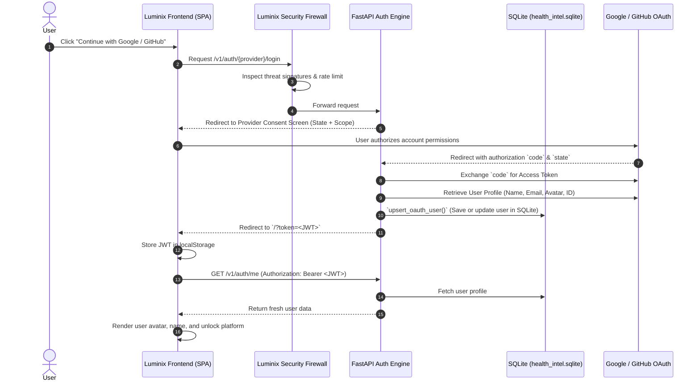

# 🛡️ Luminix Authentication, Security Firewall & OAuth Integration Guide

This guide explains how the **Luminix Security Firewall** and **OAuth 2.0 (Google & GitHub)** authentication system work, and provides exact step-by-step instructions to configure live Google and GitHub logins.

---

## 📑 Table of Contents
1. [Architecture Overview](#architecture-overview)
2. [Google OAuth 2.0 Setup Guide](#google-oauth-20-setup-guide)
3. [GitHub OAuth Setup Guide](#github-oauth-setup-guide)
4. [Environment Configuration (.env)](#environment-configuration-env)
5. [Database Persistence & User Data Synchronization](#database-persistence--user-data-synchronization)
6. [Security Firewall & Threat Protection (WAF + Rate Limiting)](#security-firewall--threat-protection)
7. [API Reference](#api-reference)

---

## 1. Architecture Overview



---

## 2. Google OAuth 2.0 Setup Guide

To enable real Google sign-in:

### Step 1: Create a Google Cloud Project
1. Go to the **[Google Cloud Console](https://console.cloud.google.com/)**.
2. Click **Select a Project** (top left) → **New Project**.
3. Name your project (e.g. `Luminix Health`) and click **Create**.

### Step 2: Configure OAuth Consent Screen
1. In the sidebar, navigate to **APIs & Services** → **OAuth consent screen**.
2. Choose **External** and click **Create**.
3. Fill in the required fields:
   - **App name**: `Luminix`
   - **User support email**: Your email address
   - **Developer contact email**: Your email address
4. Click **Save and Continue**.
5. On the **Scopes** page, click **Add or Remove Scopes** and select:
   - `.../auth/userinfo.email`
   - `.../auth/userinfo.profile`
   - `openid`
6. Click **Save and Continue**, and add your own Google email to **Test Users** if your app is in "Testing" mode.

### Step 3: Create OAuth 2.0 Credentials
1. In the sidebar, navigate to **APIs & Services** → **Credentials**.
2. Click **+ CREATE CREDENTIALS** (top) → select **OAuth client ID**.
3. Set **Application type** to `Web application`.
4. Name: `Luminix Web Client`.
5. Under **Authorized JavaScript origins**, add:
   - `http://127.0.0.1:8000`
   - `http://localhost:8000`
6. Under **Authorized redirect URIs**, add:
   - `http://127.0.0.1:8000/v1/auth/google/callback`
   - `http://localhost:8000/v1/auth/google/callback`
7. Click **Create**.
8. Copy your **Client ID** and **Client Secret**.

---

## 3. GitHub OAuth Setup Guide

To enable real GitHub sign-in:

### Step 1: Open GitHub Developer Settings
1. Go to **[GitHub Developer Settings](https://github.com/settings/developers)**.
2. In the left menu, select **OAuth Apps** → click **New OAuth App** (or **Register a new application**).

### Step 2: Register the Application
1. Fill in the application details:
   - **Application name**: `Luminix`
   - **Homepage URL**: `http://127.0.0.1:8000` (or `http://localhost:8000`)
   - **Application description**: `Luminix AI Health & Engineering System`
   - **Authorization callback URL**: `http://127.0.0.1:8000/v1/auth/github/callback`
2. Click **Register application**.

### Step 3: Generate Client Secret
1. On the app summary page, copy the **Client ID**.
2. Under **Client secrets**, click **Generate a new client secret**.
3. Copy the generated **Client Secret**.

---

## 4. Environment Configuration (`.env`)

Add the copied credentials into your `/Users/ramcharanteja/Downloads/mine/projects/luminix/.env` file:

```env
# ── Authentication & Security ─────────────────────────────
JWT_SECRET_KEY=generate-a-strong-random-32-char-secret
JWT_EXPIRE_HOURS=72

# ── URL Bases ─────────────────────────────────────────────
FRONTEND_URL=http://127.0.0.1:8000
OAUTH_REDIRECT_BASE=http://127.0.0.1:8000

# ── Google OAuth 2.0 ──────────────────────────────────────
GOOGLE_CLIENT_ID=your_google_client_id_here.apps.googleusercontent.com
GOOGLE_CLIENT_SECRET=your_google_client_secret_here

# ── GitHub OAuth ──────────────────────────────────────────
GITHUB_CLIENT_ID=your_github_client_id_here
GITHUB_CLIENT_SECRET=your_github_client_secret_here

# ── Google Gemini API (AI Insights) ───────────────────────
GEMINI_API_KEY=your_gemini_api_key
```

> [!TIP]
> If `GOOGLE_CLIENT_ID` or `GITHUB_CLIENT_ID` are left empty, Luminix automatically runs in **Instant Dev Fallback Mode**, generating realistic mock profiles and saving them in SQLite so you can test full authentication workflows without needing credentials immediately.

---

## 5. Database Persistence & User Data Synchronization

When a user logs in via Google or GitHub, Luminix retrieves their identity profile:

### Retrieved Data Fields
| Provider | Retrieved Fields | Stored In SQLite Table `users` |
| :--- | :--- | :--- |
| **Google** | `sub`, `email`, `name`, `picture`, `given_name`, `locale` | `email`, `name`, `avatar_url`, `provider='google'`, `provider_id`, `last_login`, `profile_data` |
| **GitHub** | `id`, `login`, `name`, `email` (primary verified), `avatar_url`, `bio` | `email`, `name`, `avatar_url`, `provider='github'`, `provider_id`, `last_login`, `bio`, `profile_data` |

### Upsert Behavior (`upsert_oauth_user`)
- If the user already exists by `provider_id` or `email`, their name, avatar picture, and `last_login` timestamp are updated.
- If the user is logging in for the first time, a new record is created in SQLite with their full profile.
- All telemetry, workouts, meal plans, and PDF exports are automatically associated with this authenticated account.

---

## 6. Security Firewall & Threat Protection

The **Luminix Security Firewall** runs as high-performance ASGI middleware protecting all routes.

### Active Protection Layers:
1. **Sliding-Window Rate Limiter**:
   - **Auth Endpoints** (`/v1/auth/login`, `/v1/auth/register`): Max **15 requests/min** per IP (stops credential brute-forcing & dictionary attacks).
   - **General API Endpoints** (`/v1/*`): Max **150 requests/min** per IP (prevents API flooding).
   - Returns standard HTTP `429 Too Many Requests` with `Retry-After` header.

2. **Web Application Firewall (WAF) Threat Inspection**:
   - **SQL Injection (SQLi) Shield**: Detects and blocks `UNION SELECT`, `OR 1=1`, `DROP TABLE`, `SLEEP()`, etc.
   - **Cross-Site Scripting (XSS) Sanitizer**: Blocks unescaped `<script>`, `javascript:`, `onerror=`, `<iframe>` in query parameters and paths.
   - **Directory Traversal Guard**: Blocks `../..`, `/etc/passwd`, `win.ini` file exposure attempts.
   - **Automated Scanner Blocker**: Blocks reconnaissance tools like `sqlmap`, `nikto`, `masscan`, `gobuster`.

3. **OWASP Hardened Security Headers**:
   - `X-Content-Type-Options: nosniff`
   - `X-Frame-Options: SAMEORIGIN` (Clickjacking prevention)
   - `X-XSS-Protection: 1; mode=block`
   - `Referrer-Policy: strict-origin-when-cross-origin`
   - `Permissions-Policy: camera=(self)` (allows pose tracking while locking down unauthorized sensor access)
   - `X-Firewall-Protection: Luminix-Active-Shield`

4. **Security Audit Event Logging**:
   - Every blocked threat and rate-limit trip is recorded in the `security_logs` table in SQLite for auditing.

---

## 7. API Reference

### Authentication Endpoints
- `POST /v1/auth/register` — Create email account
- `POST /v1/auth/login` — Sign in with email & password
- `GET /v1/auth/me` — Retrieve database user profile (Requires Bearer token)
- `PUT /v1/auth/profile` — Update user profile & biometric parameters
- `GET /v1/auth/google/login` — Initiate Google OAuth 2.0
- `GET /v1/auth/google/callback` — Google OAuth callback & token generation
- `GET /v1/auth/github/login` — Initiate GitHub OAuth
- `GET /v1/auth/github/callback` — GitHub OAuth callback & token generation

### Security & Firewall Endpoints
- `GET /v1/auth/firewall/status` — Live firewall metrics, threats blocked, and rate-limiting stats
- `GET /v1/auth/firewall/logs` — Inspect recent security firewall logs & blocked threats
- `GET /health` — Liveness check including firewall & OAuth config states
